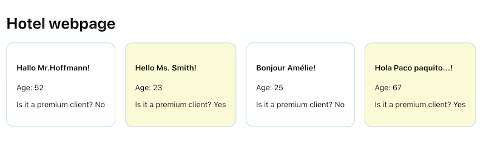

# Props exercise ☕️

This app was created with <code>create-react-app</code>, so, the only thing left to do before you start coding is:

```bash
npm install
npm start
```

## Goals 🎯

On <code>App.js</code> you are given an array of clients:

```js
const clients = [
    {
      name: 'Mr.Hoffmann',
      age: 52,
      isPremium: false,
      country: 'de',
    },
    {
      name: 'Ms. Smith',
      age: 23,
      isPremium: true,
      country: 'en',
    },
    {
      name: 'Amélie',
      age: 25,
      isPremium: true,
      country: 'fr',
    },
    {
      name: 'Paco paquito...',
      age: 67,
      isPremium: true,
      country: 'es',
    },
  ]
```

The goal of this exercise is to create a **reusable card** (just one component), that we will import on <code>App.js</code> and we will use to print each of these clients, and the card will change according to the information passed by props. The final result should look like this:




Each <code>Card</code> should print:
- The name of the client passed as childrem
- The age of the client passed by props
- It should answer "yes" or "no" to the question "Is it a premium client?" with he information passed by props
- The greeting (the "Hello" part) should be different according to the country of the client
- If the user is premium, the background color should be different.

> 💡 Note: you already have a couple of styles on <code>App.css</code> ready to be used.

***When you are finished***, you should be able to import the Card four times on <code>App.js</code>, and pass to each card one client, like this:

```js
  return (
    <div className="App">
      <h1>Hotel webpage</h1>
      <section className="cards">
        <Card client={clients[0]}>{clients[0].name}</Card>
        <Card client={clients[1]}>{clients[1].name}</Card>
        <Card client={clients[2]}>{clients[2].name}</Card>
        <Card client={clients[3]}>{clients[3].name}</Card>
      </section>
    </div>
  );
}
```


